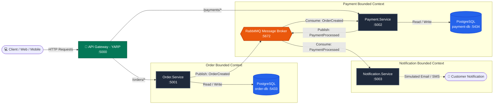

# 🛒 Distributed Order Platform (Microservices, Event-Driven Architecture & API Gateway)

[](https://dotnet.microsoft.com/)
[](https://www.rabbitmq.com/)
[](https://masstransit.io/)
[](https://microsoft.github.io/reverse-proxy/)
[](https://www.postgresql.org/)
[](https://www.docker.com/)

> A modern, production-ready distributed order management system built with **ASP.NET Core (.NET 10)**, featuring asynchronous event-driven messaging via **MassTransit & RabbitMQ**, unified perimeter routing through a **YARP API Gateway**, and strict adherence to the **Database-per-Service** pattern with isolated **PostgreSQL** instances.

---

## 🎯 Architecture & Design Philosophy

This platform is engineered to break monolith anti-patterns by eliminating tight coupling and establishing independent service autonomy, resilience, and horizontal scalability.

### 🔑 Key Architectural Principles:
* **API Gateway (Single Entry Point):** All external client traffic (Web/Mobile) targets the YARP Gateway (`:5000`). Clients never call internal microservice ports directly.
* **Database-per-Service:** `Order.Service` and `Payment.Service` connect to completely isolated PostgreSQL instances (`order-db:5433` and `payment-db:5434`). There are **zero cross-database SQL JOINs** and no physical database foreign keys across bounded contexts.
* **Loose Coupling (Asynchronous Event Bus):** Services communicate exclusively via RabbitMQ events (`OrderCreated`, `PaymentProcessed`). If `Payment.Service` or `Notification.Service` is temporarily unavailable, messages wait safely in durable queues without breaking user operations.
* **MassTransit Abstraction:** Provides automated exchange/queue topology binding, strongly-typed JSON serialization, retry policies, and dead-letter error handling.

---

## 🏛️ System Architecture Flow



---

## 🛠️ Tech Stack

| Category | Technology | Purpose |
| :--- | :--- | :--- |
| **Framework** | .NET 10 (ASP.NET Core Web API) | High-performance C# Minimal APIs |
| **API Gateway** | Microsoft YARP (v2.2) | Reverse proxy, path routing & perimeter rate limiting |
| **Message Broker** | RabbitMQ 3 (Management) | Distributed pub/sub messaging engine |
| **Service Bus** | MassTransit (v8.3) | Topology auto-configuration & consumer abstraction |
| **Data Access / ORM** | Entity Framework Core & Npgsql | PostgreSQL provider and schema auto-creation |
| **Databases** | PostgreSQL 16 (Alpine) | Isolated database per microservice |
| **Orchestration** | Docker & Docker Compose | Containerized local infrastructure |
| **API Documentation** | Swagger / OpenAPI | Interactive endpoint explorer |

---

## 📂 Solution Structure

```
order-platform-learning/
├── docker-compose.yml              # RabbitMQ (5672/15672), order-db (5433), payment-db (5434)
├── OrderPlatform.sln               # Central solution linking all 5 projects
├── .env.example                    # Environment variable template
├── .gitignore                      # Standard .NET / Docker ignore rules
│
├── Gateway/                        # YARP API Gateway (Port: 5000)
│   ├── appsettings.json            # Reverse proxy routes (/orders/*, /payments/*)
│   └── Program.cs                  # YARP middleware & perimeter rate limiting
│
├── Shared.Contracts/               # Shared message contracts (events/commands)
│   └── Events/
│       ├── OrderCreated.cs         # Event: OrderId, ProductName, TotalPrice...
│       └── PaymentProcessed.cs     # Event: PaymentId, OrderId, Amount, Status...
│
├── Order.Service/                  # Order publisher microservice (Port: 5001)
│   ├── Data/OrderDbContext.cs      # EF Core PostgreSQL context
│   ├── Models/Order.cs             # Order entity
│   ├── DTOs/OrderDtos.cs           # Request & Response DTOs
│   └── Program.cs                  # MassTransit PublishEndpoint & validation
│
├── Payment.Service/                # Payment consumer & publisher (Port: 5002)
│   ├── Consumers/
│   │   └── OrderCreatedConsumer.cs # Consumes OrderCreated -> writes DB -> publishes PaymentProcessed
│   ├── Data/PaymentDbContext.cs    # EF Core PostgreSQL context
│   ├── Models/Payment.cs           # Payment entity (Logical reference to OrderId)
│   └── Program.cs                  # MassTransit consumer configuration
│
└── Notification.Service/           # Notification consumer microservice (Port: 5003)
    ├── Consumers/
    │   └── PaymentProcessedConsumer.cs # Consumes PaymentProcessed -> sends Email/SMS
    └── Program.cs                  # MassTransit consumer configuration
```

---

## ⚡ Quick Start Guide

### 1. Prerequisites
* [.NET 10 SDK](https://dotnet.microsoft.com/)
* [Docker Desktop](https://www.docker.com/)

### 2. Configure Environment
Copy the environment template and adjust credentials if needed:
```bash
cp .env.example .env
```

### 3. Start Infrastructure (Docker)
Spin up RabbitMQ and the two PostgreSQL instances with a single command:
```bash
docker compose up -d
```
* **RabbitMQ Dashboard:** [http://localhost:15672](http://localhost:15672) *(User: `guest` / `guest`)*

### 4. Run the Platform

Open separate terminal tabs for each service (or launch via your IDE):

**Terminal 1 — API Gateway:**
```bash
cd Gateway && dotnet run
```
*Gateway URL:* [http://localhost:5000](http://localhost:5000)

**Terminal 2 — Order.Service:**
```bash
cd Order.Service && dotnet run
```
*Direct Swagger:* [http://localhost:5001/swagger](http://localhost:5001/swagger)

**Terminal 3 — Payment.Service:**
```bash
cd Payment.Service && dotnet run
```
*Direct Swagger:* [http://localhost:5002/swagger](http://localhost:5002/swagger)

**Terminal 4 — Notification.Service:**
```bash
cd Notification.Service && dotnet run
```

---

## 🧪 Live Event-Driven Verification (Through Gateway)

Notice how all client requests go directly to the **API Gateway on port 5000**:

### 1. Place an Order through the Gateway
```bash
curl -X POST http://localhost:5000/orders \
  -H "Content-Type: application/json" \
  -d '{"productName": "MacBook Pro M3", "quantity": 1, "totalPrice": 2499.99}'
```

### 2. Observe the Asynchronous Event Chain
1. **Gateway (`:5000`):** Routes request to `Order.Service` (`:5001`).
2. **Order.Service (`:5001`):** Saves order to `order-db` and publishes `OrderCreated` to RabbitMQ.
3. **Payment.Service (`:5002`):**
   ```text
   📬 [RabbitMQ] OrderCreated Event Alındı! OrderId: 7b... Tutar: $2,499.99
   ✅ [Ödeme Başarılı] PaymentId: ... payment-db'ye kaydedildi.
   📢 [RabbitMQ] PaymentProcessed Event Yayınlandı!
   ```
4. **Notification.Service (`:5003`):**
   ```text
   📬 [RabbitMQ] PaymentProcessed Event Alındı!
   📧 [E-POSTA GÖNDERİLDİ] Sayın Müşteri, #7b... numaralı siparişiniz için $2,499.99 tutarındaki ödemeniz başarıyla alınmıştır.
   📱 [SMS GÖNDERİLDİ] Siparişiniz onaylandı.
   ```

### 3. Query Payments through the Gateway
```bash
curl http://localhost:5000/payments
```

---

## 🔐 Security Practices

This project implements the following security measures to demonstrate production-aware development habits:

### Secrets Management
- **No hardcoded credentials** in source code — RabbitMQ and PostgreSQL credentials are loaded from configuration files, **never from `Program.cs` literals**.
- **Configuration hierarchy:** `appsettings.json` (committed, no secrets) → `appsettings.Development.json` (local dev overrides) → Environment Variables (production).
- **Docker Compose** reads credentials from a `.env` file which is **gitignored** and never committed. A `.env.example` template is provided.

### Input Validation
- `POST /orders` validates `ProductName` (required, max 200 chars), `Quantity` (must be > 0), and `TotalPrice` (must be > 0) before processing. Invalid requests receive `400 Bad Request` with detailed error messages.

### Transport Security & Rate Limiting
- `UseHttpsRedirection()` enforces HTTPS transport encryption across services.
- Built-in ASP.NET Core rate limiting middleware is applied at the Gateway and service levels to mitigate abuse and DoS attacks.

### API Gateway Architecture
- Internal microservices are decoupled from external direct internet access.
- In production, JWT token validation and authorization are enforced centrally at the Gateway before routing to internal private networks.

---

## 🗺️ Project Roadmap

- [x] **Phase 1:** Docker infrastructure setup (RabbitMQ + multiple PostgreSQL containers).
- [x] **Phase 2:** `Order.Service` standalone CRUD implementation with EF Core PostgreSQL.
- [x] **Phase 3:** Event contract definition in `Shared.Contracts` and MassTransit publisher setup.
- [x] **Phase 4:** `Payment.Service` implementation with MassTransit consumer and isolated database.
- [x] **Phase 5:** `Notification.Service` (Consumer for `PaymentProcessed` lifecycle alerts).
- [x] **Phase 6:** API Gateway integration via Microsoft YARP (Single entry point & routing).
- [ ] **Phase 7:** End-to-end containerization with root Docker Compose orchestration.
- [ ] **Phase 8:** Distributed Observability (Health Checks, OpenTelemetry / Serilog + Seq).

---

## 👩‍💻 Author
**Melike Arslan** — [GitHub Profile](https://github.com/melikee46)
