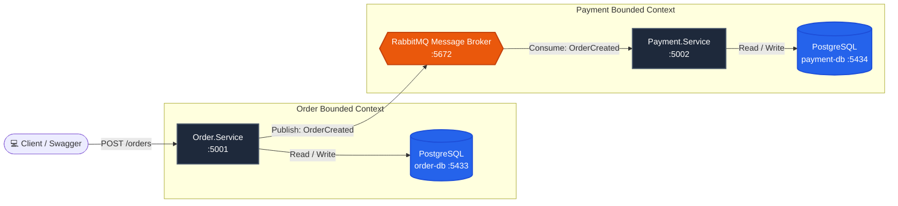

# 🛒 Distributed Order Platform (Microservices & Event-Driven Architecture)

[](https://dotnet.microsoft.com/)
[](https://www.rabbitmq.com/)
[](https://masstransit.io/)
[](https://www.postgresql.org/)
[](https://www.docker.com/)

> A modern, highly scalable distributed order processing system built with **ASP.NET Core (.NET 10)**, featuring asynchronous event-driven communication via **MassTransit & RabbitMQ**, and adhering to the **Database-per-Service** pattern with isolated **PostgreSQL** instances.

---

## 🎯 Architecture & Design Philosophy

This platform is engineered to break monolith anti-patterns by eliminating tight coupling and establishing independent service autonomy, resilience, and horizontal scalability.

### 🔑 Key Architectural Principles:
* **Database-per-Service:** `Order.Service` and `Payment.Service` connect to completely isolated PostgreSQL instances (`order-db:5433` and `payment-db:5434`). There are **zero cross-database SQL JOINs** and no physical database foreign keys across bounded contexts.
* **Loose Coupling (Asynchronous Messaging):** Services never communicate synchronously over HTTP for write transactions. Instead, they broadcast events via RabbitMQ exchanges.
* **High Resilience & Fault Tolerance:** If `Payment.Service` undergoes downtime or deployment, `Order.Service` continues to process incoming orders seamlessly. Events queue safely in RabbitMQ without data loss.
* **MassTransit Abstraction:** Provides automated exchange/queue topology binding, strongly-typed JSON serialization, retry policies, and dead-letter error handling.

---

## 🏛️ System Architecture Flow



---

## 🛠️ Tech Stack

| Category | Technology | Purpose |
| :--- | :--- | :--- |
| **Framework** | .NET 10 (ASP.NET Core Web API) | High-performance C# Minimal APIs |
| **Message Broker** | RabbitMQ 3 (Management) | Distributed event messaging and pub/sub |
| **Service Bus** | MassTransit (v8.3) | Abstraction, queue topology & consumer management |
| **Data Access / ORM** | Entity Framework Core & Npgsql | PostgreSQL provider and automated schema bootstrap |
| **Database** | PostgreSQL 16 (Alpine) | Isolated database per microservice |
| **Orchestration** | Docker & Docker Compose | Containerized local development infrastructure |
| **API Documentation** | Swagger / OpenAPI | Interactive endpoint explorer and testing |

---

## 📂 Solution Structure

```
order-platform-learning/
├── docker-compose.yml              # RabbitMQ (5672/15672), order-db (5433), payment-db (5434)
├── OrderPlatform.sln               # Central solution linking all projects
├── .gitignore                      # Standard .NET / Docker ignore rules
│
├── Shared.Contracts/               # Shared message contracts (events/commands)
│   └── Events/
│       └── OrderCreated.cs         # Event record contract: OrderId, ProductName, TotalPrice...
│
├── Order.Service/                  # Order publisher microservice (Port: 5001)
│   ├── Data/OrderDbContext.cs      # EF Core PostgreSQL context
│   ├── Models/Order.cs             # Order entity definition
│   ├── DTOs/OrderDtos.cs           # Request & Response data transfer objects
│   └── Program.cs                  # MassTransit PublishEndpoint configuration
│
└── Payment.Service/                # Payment consumer microservice (Port: 5002)
    ├── Consumers/
    │   └── OrderCreatedConsumer.cs # Listens to RabbitMQ, processes & stores payments
    ├── Data/PaymentDbContext.cs    # EF Core PostgreSQL context
    ├── Models/Payment.cs           # Payment entity (Logical reference to OrderId)
    └── Program.cs                  # Consumer subscription & endpoint auto-binding
```

---

## ⚡ Quick Start Guide

### 1. Prerequisites
* [.NET 10 SDK](https://dotnet.microsoft.com/)
* [Docker Desktop](https://www.docker.com/)

### 2. Start Infrastructure (Docker)
Spin up RabbitMQ and the two PostgreSQL instances with a single command:
```bash
docker compose up -d
```
* **RabbitMQ Management Dashboard:** [http://localhost:15672](http://localhost:15672)  
  *(Credentials: `guest` / `guest`)*

### 3. Run Microservices

Open two terminal windows:

**Terminal 1 — Order.Service:**
```bash
cd Order.Service
dotnet run
```
* Swagger UI: [http://localhost:5001/swagger](http://localhost:5001/swagger)

**Terminal 2 — Payment.Service:**
```bash
cd Payment.Service
dotnet run
```
* Swagger UI: [http://localhost:5002/swagger](http://localhost:5002/swagger)

---

## 🧪 Live Event-Driven Verification

### 1. Place an Order (POST Request)
Trigger a new order creation via cURL or Swagger:
```bash
curl -X POST http://localhost:5001/orders \
  -H "Content-Type: application/json" \
  -d '{"productName": "MacBook Pro M3", "quantity": 1, "totalPrice": 2499.99}'
```

### 2. Observe Asynchronous Consumption
In the `Payment.Service` terminal, notice the event received and processed in real time:
```text
📬 [RabbitMQ] OrderCreated Event Received! OrderId: 8a... Item: MacBook Pro M3, Total: $2,499.99
✅ [Payment Succeeded] PaymentId: ... for OrderId: ... persisted into payment-db.
```

### 3. Inspect Processed Payments
Query `Payment.Service` to verify the payment record was created in its dedicated database:
```bash
curl http://localhost:5002/payments
```

---

## 🗺️ Project Roadmap

- [x] **Phase 1:** Docker infrastructure setup (RabbitMQ + multiple PostgreSQL containers).
- [x] **Phase 2:** `Order.Service` standalone CRUD implementation with EF Core PostgreSQL.
- [x] **Phase 3:** Event contract definition in `Shared.Contracts` and MassTransit publisher setup.
- [x] **Phase 4:** `Payment.Service` implementation with MassTransit consumer and isolated database.
- [ ] **Phase 5:** `Notification.Service` (Consumer for order/payment lifecycle alerts).
- [ ] **Phase 6:** API Gateway integration via YARP (Single entry point & routing).
- [ ] **Phase 7:** End-to-end containerization with root Docker Compose orchestration.
- [ ] **Phase 8:** Distributed Observability (Health Checks, OpenTelemetry / Serilog + Seq).

---

## 👩‍💻 Author
**Melike Arslan** — [GitHub Profile](https://github.com/melikee46)
